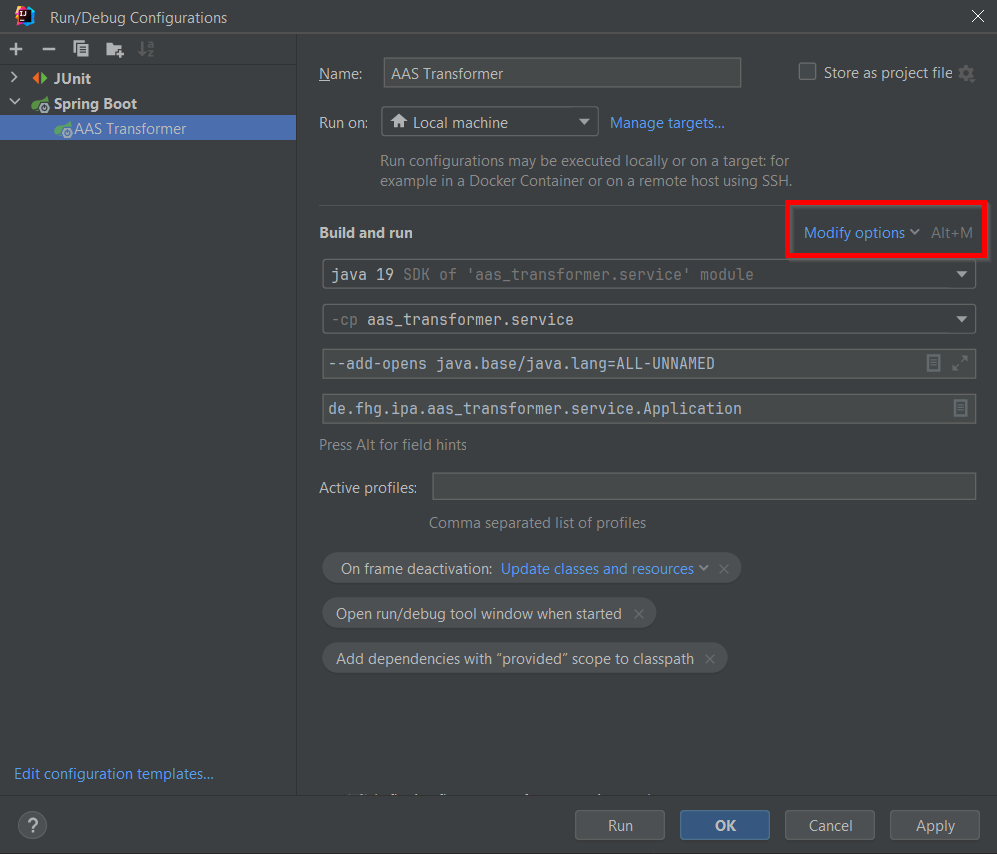
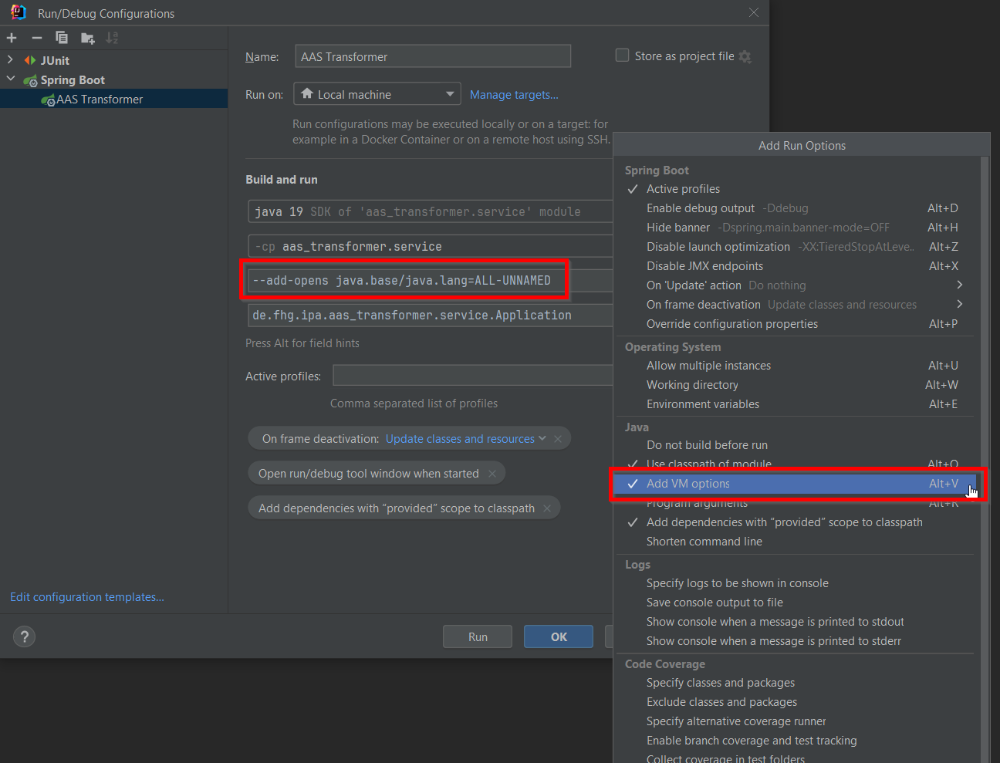

# aas-transformer

## Development

### JVM Options

As the [jinjava](https://github.com/HubSpot/jinjava) library uses reflection, the following option must be set for the 
JVM to execute the programme and to run  tests:
```--add-opens java.base/java.lang=ALL-UNNAMED```

Edit JVM options in IntelliJ:




## Templating

### Functions

Functions which can be used in Jinja templates:
* aas
    * sme_value
      * Get submodel element value.
      * Parameters:
          * `aasId` (String): Id of the AAS which contains the submodel element value.
          * `smId` (String): Id of the submodel which contains the submodel element value.
          * `smeId` (String): Id of the submodel element value.
      * Example: ```{{ aas:sme_value('58731afb-2be8-4165-ae60-8c65a1a09550', 'my_submodel', 'my_sme') }}```
* app
    * prop
        * Get value of application property.
        * Parameters:
            * `propKey` (String): Key of the property.
        * Example: ```{{ app:prop('aas.server.url') }}```
* uuid
     * generate
        * Generate a UUID.
        * Parameters: None
        * Example: ```{{ uuid:generate() }}```

### Context variables
Context variables which are available in Jinja templates:
* `SOURCE_AAS`: Id of the source AAS of the transformer.

